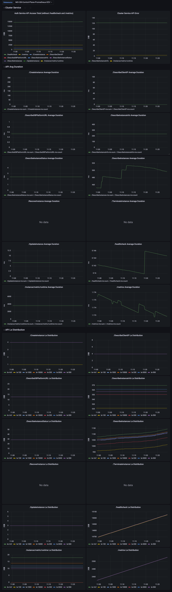
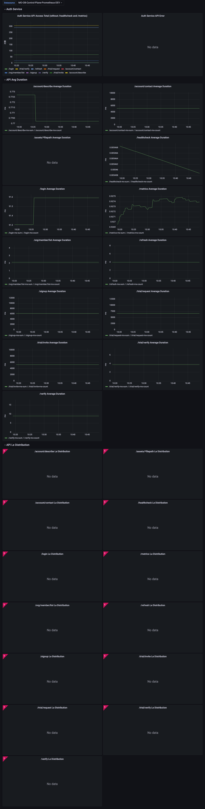
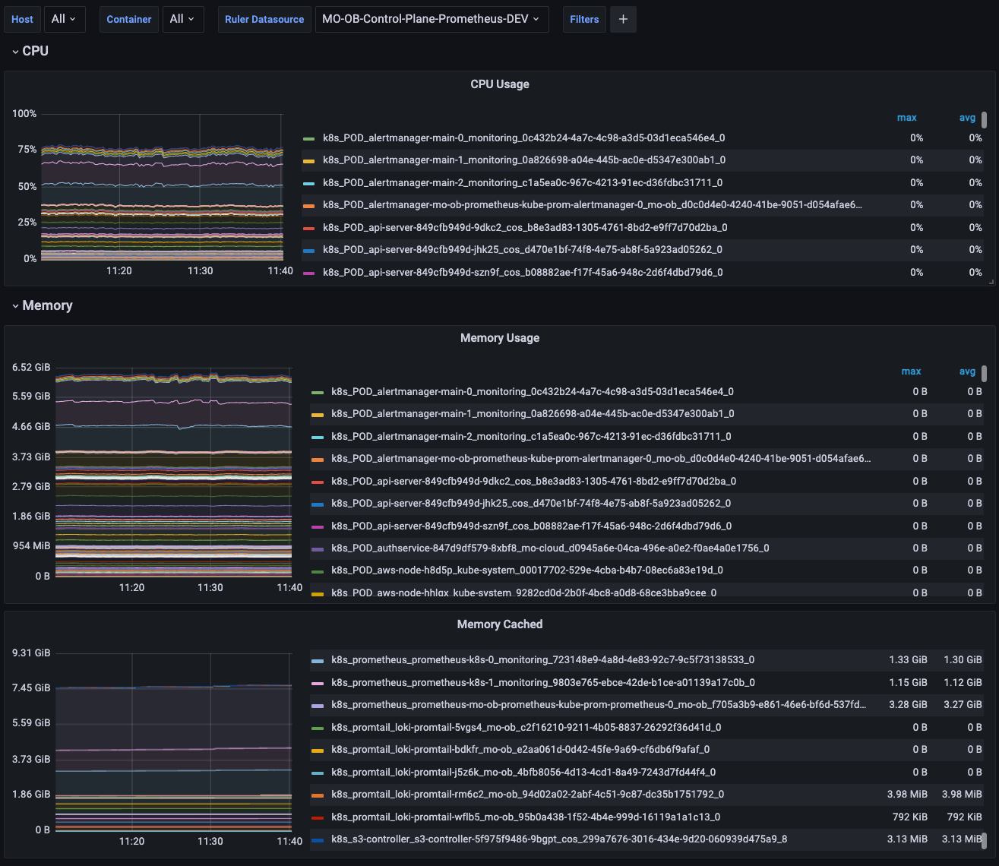
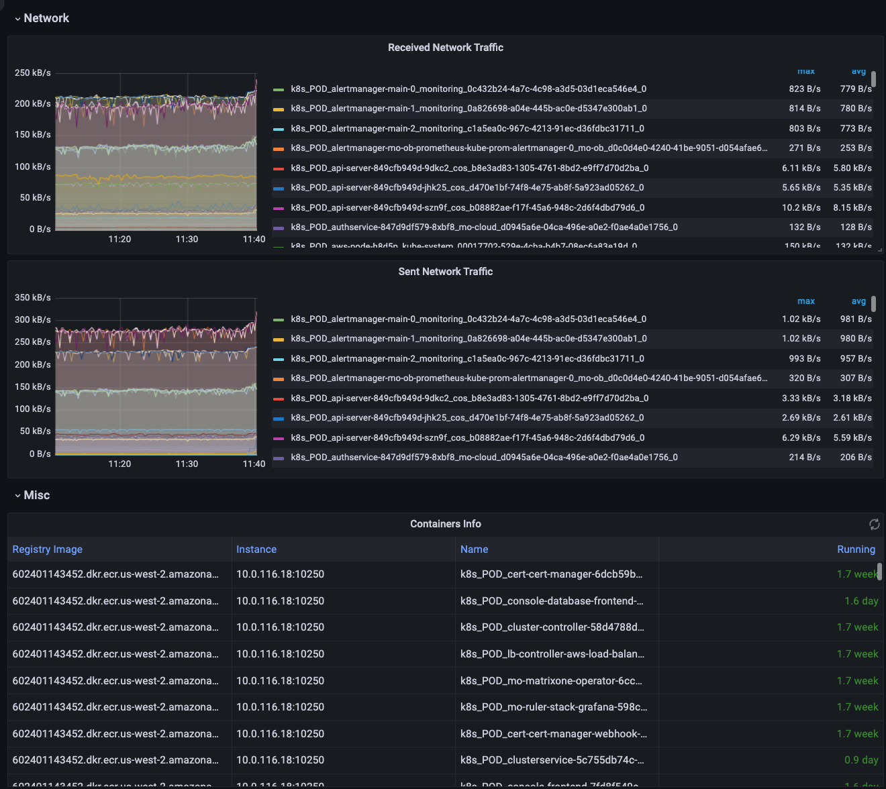
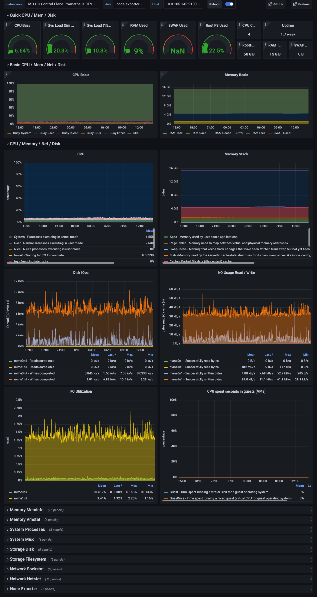
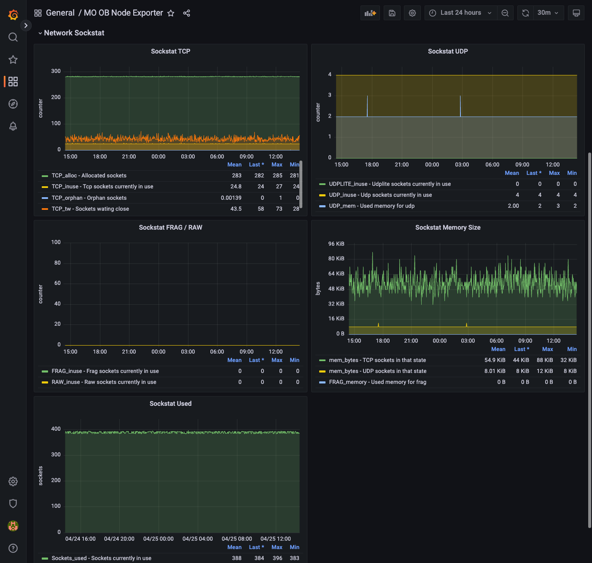
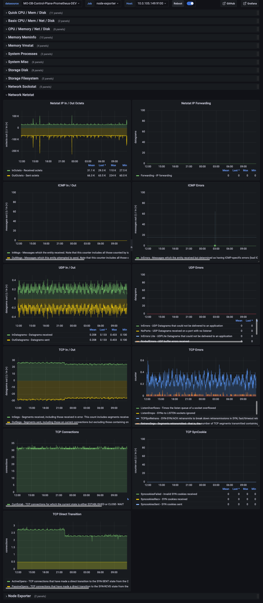

# MOCloud Dashboard

| Title                     | Desc                                   |
| ------------------------- | -------------------------------------- |
| MOCloud / Cluster Service | MOCloud Cluster Service 指标视图       |
| MOCloud / Auth Service    | MOCloud Auth Service 指标视图          |
| MOCloud / cAdvisor        | cAdvisor 指标视图                      |
| MOCloud / Nodes           | Node Exporter采集的 机器指标（详情版） |
| MOCloud / Logs            | Logs 查询视图                          |

## MOCloud / Cluster Service

## MOCloud / Auth Service

## MOCloud / cAdvisor

## MOCloud / Nodes
- Quick Look CPU / MEM / Net / DISK

- Network Sockstat

- Network Netstat

## MOCloud / Logs

